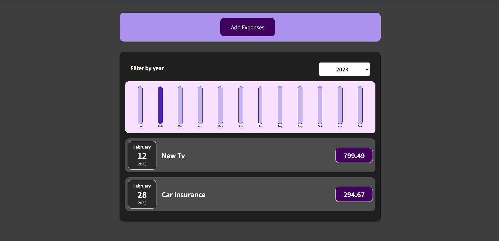
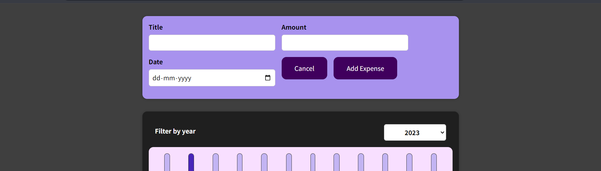

# Expense Planner

An intuitive and user friendly expense planner application built using React. This project is designed to help users manage their expenses with visuals.  
Demo: https://expense-planner.vercel.app

## Installation

1. Install the dependencies :  
 ```
 npm install
 ```
2. Define environment variable:'
```
REACT_APP_API_KEY = firebase database link
``` 
3. Run development server : 
```
npm start 
```
---




---

Feel free to further modify and expand the content to better fit your project's specifics.
